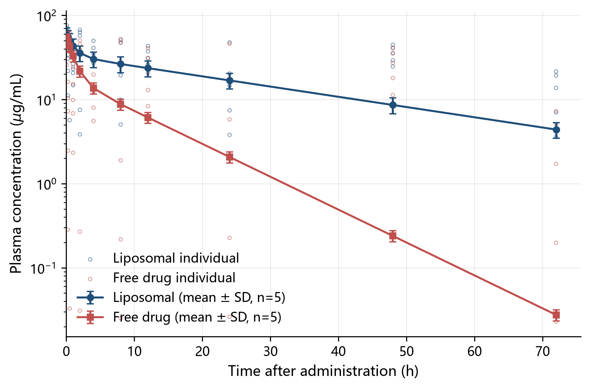
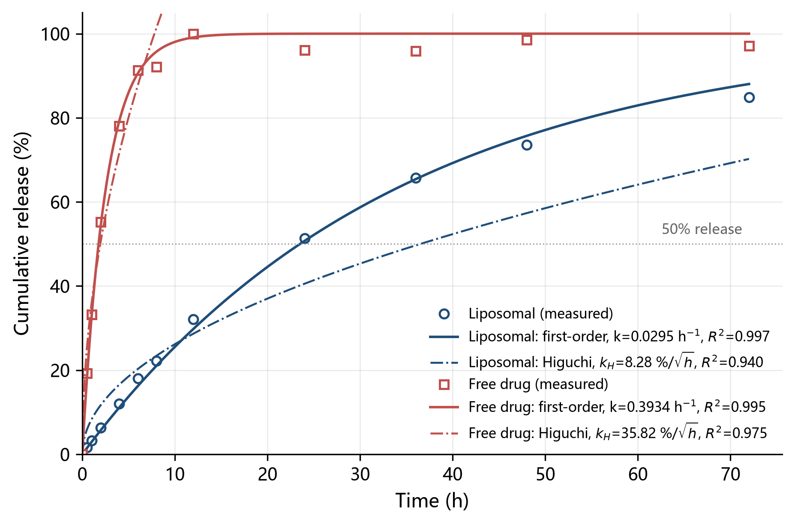
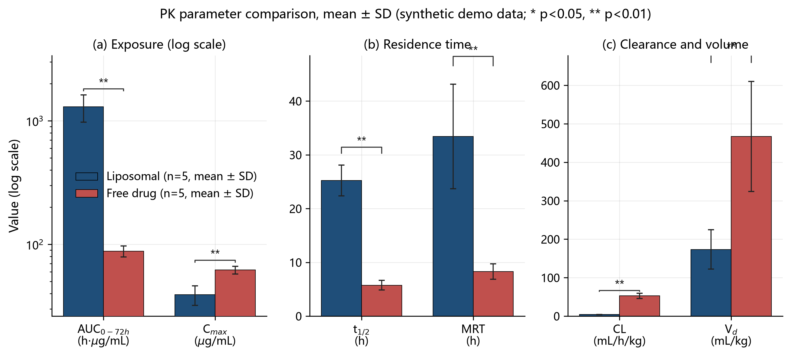

# Vesi-Labflow

> **A research workflow engine for pharmaceutical and life sciences** — turning *literature → experimental design → data records → statistics → manuscript* into **11 modules + 1 base layer**, each with an **executable gate** and an **explicit degradation path**.
> **It does not think for you, and it does not conclude for you — it makes sure every step you take leaves an auditable evidence trail.** Missing pieces are marked `[降级]`/`SKIP` and always reported, never silently passed.
> Chinese version: [`README.md`](README.md) (Chinese is the source of truth; the English mirror follows within 7 days — see `CONTRIBUTING.md`).
> **CI**: `.github/workflows/ci.yml` runs the self-checks and smoke chains on every push/PR (Python 3.11 + 3.13); the CI badge and repository links land once the repository URL is fixed.

`Vesi-Labflow` is not a "one-click paper generator". It is a **process you can audit**: every module has gates, every claim maps back to evidence, and every missing component degrades honestly with a `[降级]` (degraded) marker instead of pretending to work.

**This product does not depend on** any specific agent, CLI, scheduler, or API key — anyone (or any agent) who can read files and run Python 3.11+ can use it.

---

## Who it is for

| Audience | Why |
|---|---|
| Pharmacy students/researchers (formulation, PK, bioanalysis) | Domain tools with known-answer self-tests |
| Life-science students/researchers (cell / molecular / animal) | Design, record and statistics discipline in one place |
| Contest teams (innovation / challenge programs) | Auditable process instead of ad-hoc generation |
| Anyone using AI as a *research assistant* | Gates, evidence chains and honest degradation |

**Not for**: one-click paper generation, fabricating or polishing data, or evading academic-integrity review.

## Quick start (three-step loading)

```
1. Read BOOT.md → VESI-CORE.md → VESI-ENGINE.md
2. Pick a runbook and load workflows/NN-*.md + workflows/_SHARED.md
3. Call tools/ or scripts/ when you need computation or gates; mark missing pieces as [降级]
```

Then:

```bash
python -m venv .venv          # <venv> below = the venv dir you just created
<venv>/Scripts/python -m pip install -r requirements.txt   # Windows
<venv>/bin/python     -m pip install -r requirements.txt   # Linux/macOS

python tools/env_check.py --selftest      # environment self-check + degradation probe
python tools/smoke_chain.py --selftest    # end-to-end smoke chain (with numeric assertions)
python tools/nca.py --selftest            # non-compartmental analysis (per-subject support)
python tools/stats_pipeline.py --selftest # statistics pipeline (paired long-table case)
```

See [`QUICKSTART.md`](QUICKSTART.md) for the 5-minute path and [`AGENTS.md`](AGENTS.md) if you are a code agent.

## What you get in 5 minutes

Everything below comes from **actually running this repo** (synthetic data, fixed seeds) — no mock-ups:

| Artifact | What it is | How to get it |
|---|---|---|
|  | plasma concentration–time curve from `tools/fig_samples/fig1_pk_curve.py` (two groups, mean ± SD + individual points) | sample output of the very pipeline behind step 3 in `QUICKSTART.md` — swap the data block for yours to get the same shape |
|  | in-vitro release points + first-order & Higuchi fits (R² printed in the terminal) | what step 5.3 of `QUICKSTART.md` does (`workflows/04-体外释放.md` + `tools/release_fit.py`) |
|  | 1×3 PK-parameter panel from `tools/fig_samples/fig3_pk_bar.py` | the typical artifact of the statistics/visualisation stage (step 5.4) |

How to run the whole sample set: `tools/fig_samples/README.md`.

## Capability map

| # | Module | What it does | Gate highlights |
|---|---|---|---|
| V-M1 | Literature | search → close reading → evidence table | verifiable metadata; three-state labels; reproducible queries |
| V-M2 | Design workshop | design cards (variables / controls / n / pre-registration / dose chain / ethics) | complete controls; n and power; statistics fixed *before* the experiment |
| V-M3 | Record line | structured records + read-only raw archive | complete fields; raw data immutable; traceable paths |
| V-M4 | Statistics bench | auditable analysis | three certificates (normality / effect size + CI / multiple comparisons); n=3 discipline |
| V-M5 | Domain bench (PK / release / distribution / excretion) | NCA · compartmental fit · release modelling · cumulative excretion | complete parameters; goodness of fit; **per-subject NCA correctness** |
| V-M6 | Figure workshop | PNG + PDF + SVG + captions | three gates (overflow / file layer / visual) |
| V-M7 | Paper assembly | IMRaD → docx/md | per-section checklist; claim-evidence map; hygiene assertions FAIL=0 |
| V-M8 | Multi-track rewriting | master → target track | anonymisation per target; no cross-track leakage; no duplicate submission |
| V-M9 | Application & defence | proposals / slides / Q&A | format benchmarking; structural self-check |
| V-M10 | Calibration hook | read-only mount of *your* private calibration | **declaration only**; personal calibration ≠ module gate |
| V-M11 | Orchestrator | runbook + hand-off card | one hand-off per deliverable |
| V-R | Base | environment / smoke / troubleshooting | `env_check`; `smoke_chain`; all `--selftest` |

## Repository layout

```
Vesi-Labflow/
├── BOOT.md                 # ≤2 KB cold-start file
├── README.md / README.en.md
├── AGENTS.md               # generic loading protocol for code agents
├── QUICKSTART.md · CHANGELOG.md · CITATION.cff · requirements.txt
├── LICENSE (MIT) · LICENSE-DOCS (CC BY 4.0) · THIRD-PARTY.md
├── VESI-CORE.md · VESI-ENGINE.md
├── learnings.md            # blank template + distillation mechanism
├── modules/                # V-M1 … V-M11 + base (each with a degradation column)
├── workflows/              # 01–13 + _SHARED.md + D-ABSORB.md
├── templates/              # design cards, record templates, caption template, calibration ledger, anchor card
├── references/             # anchor protocol, statistics notes, figure pipeline, paper SOP, troubleshooting
├── tools/                  # env_check · smoke_chain · nca · compartment_fit · release_fit · stats_pipeline
├── scripts/                # delivery gates (hygiene, consistency, similarity, bundle & manifest checks, …)
├── kb/                     # your own knowledge base (empty; see kb/README.md)
├── docs/images/            # samples produced by real runs (see "What you get in 5 minutes")
├── SUPPORT.md · MAINTAINERS.md · .pre-commit-config.yaml / .editorconfig / .gitattributes
└── .github/                 # CI (workflows/ci.yml) · issue & PR templates · CODEOWNERS · dependabot
```

## Requirements & degradation

- **Python 3.11+**; see `requirements.txt`.
- **Optional**: OCR endpoint, Word COM (Windows), LaTeX — each degrades with a `[降级]` marker and a note; nothing is faked.

## Layer model (L0 / L1 / L2)

| Layer | Content | Shipped? |
|---|---|---|
| **L0** | ENGINE, modules, workflows, templates, references, tools, scripts | ✅ fully open |
| **L1** | track/domain profiles | generic examples only |
| **L2** | your private calibration ledger, anchor cards, shared collaboration layer | ❌ not shipped — build your own (`kb/`, `<校准台账>`, `<锚注册卡>/`) |

## Integrity & licensing

- AI is an **assistant**: data and conclusions must be yours; see the academic-integrity clauses in `VESI-CORE.md` and the relevant workflows.
- Code: **MIT** (`LICENSE`). Documentation: **CC BY 4.0** (`LICENSE-DOCS`). Third-party assets: see `THIRD-PARTY.md`.
- No official materials, third-party papers, or real experimental data are included.

## Maintenance

- Maintainers / support: `MAINTAINERS.md` · `SUPPORT.md` (run the self-checks first; first response ≤ 7 days).
- Versioning & rollback: `CHANGELOG.md` (SemVer tag convention; tag entries double as release notes).
- Before opening a PR: `pip install pre-commit && pre-commit run --all-files`.
- Docs-vs-disk consistency: `python scripts/verify_manifest.py --root .` (a missing referenced file → `rc=1`; usage error → `rc=2`).
