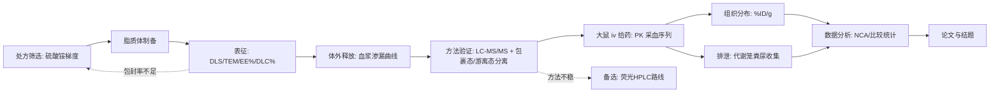

# 目标赛道申报书写作工作流

> 项目：候选药物 X 脂质体与参比制剂在体内释放、组织分布及排泄特征的比较研究
> 创建：2026-08-19 | 主题适配：2026-08-30 | 维护：Vesi
> 状态：⏳ 提前准备（目标赛道尚未开始报名）

---

## 📋 工作流总览

```
① 选题论证（四维框架）
    ↓
② 文献综述（知识库联动）
    ↓
③ 填写申报书各章节
    ↓
④ 创新点打磨（≤3 条可验证）
    ↓
⑤ 技术路线图（mermaid）
    ↓
⑥ 预算/进度/风险
    ↓
⑦ 审稿人视角自查 + 得分点对标
    ↓
⑧ 定稿提交
```

---

## ① 选题论证（四维框架）

> 来自自建申报写作 SOP。动笔前必须先过这四关。

| 维度 | 自问 | 本项目回答（草案）|
|------|------|------------------|
| **创新性** | 与已有脂质体研究比多了什么？ | 同体系头对头比较：**包裹态/游离态分别测定**的直接"体内释放"证据链（多数研究只测总浓度）+ 释放-分布-排泄三环节贯通 |
| **可行性** | 设备/经费/时间/技术门槛 | 学校平台 DLS/TEM 可预约；LC-MS/MS（或荧光 HPLC）由导师实验室/测试中心支持；动物房资质；本科可完成制剂与取样 |
| **成果可视化** | 能出几张漂亮的图？ | 药时曲线（半对数）、组织分布热图、累积排泄回收率曲线、包裹态/游离态占比-时间曲线、TEM 形貌 |
| **社会意义** | 解决什么问题？ | 脂质体等纳米制剂的临床快速扩容 vs 体内行为数据不足——为"仿制/自研脂质体与普通参比制剂差异"提供可复现的体内证据，服务精准用药 |

**三大现实冷水（评审好感度关键）**：脂质体体内稳定性存疑（蛋白冠）、EPR 效应人体争议、包封药物体内释放行为不确定——**主动写进"挑战与对策"**，比装看不见得分高。
> 引用冷水时必带实证出处：`references/cold-water-evidence.md`（三冷水各 2-3 篇，全部经 NCBI esummary 实证；旧方向三条冷水保留在文件历史分区）。

---

## ② 文献综述（知识库联动）

### 写法

1. **先查知识库**：`kb/` 的 [[候选药物 X]] [[脂质体]] [[药代动力学]] [[组织分布]] [[排泄与代谢]] [[体外释放]] 页面（主题适配后核心页）
2. **按技术路线五环节组织**：制剂制备与表征 → 体外释放 → 体内 PK → 组织分布 → 排泄与代谢
3. **每条论断标三态**：[事实]（有文献）/ [推断] / [假设]
4. **引用必须可查**：PMID/DOI 齐全，绝不编造

### 综述结构

```
1. 疾病负担与候选药物 X 的临床地位（<适应症数据占位>）
2. 普通参比制剂的局限（半衰期短、全身毒性：腹泻/骨髓抑制）
3. 脂质体化策略与已上市品种（<已上市同类品种：长循环、AUC↑；国产仿制进展>）
4. 现有体内证据的缺口 ← Gap 在这里：多数研究只测总浓度，
   "体内释放"缺乏包裹态/游离态分别测定的直接证据
5. 本项目的切入点：同体系头对头比较 + 释放-分布-排泄贯通
```

---

## ③ 申报书章节模板

> 按常见目标赛道申报书结构（各校略有差异，以学校模板为准）

### 项目背景与研究意义

```markdown
- 疾病负担：<适应症> 发病率与死亡率数据（引用 WHO/国家癌症中心）
- 现有治疗痛点：候选药物 X 参比制剂半衰期短、个体变异大、迟发性腹泻与骨髓抑制限制剂量
- 脂质体化价值：已上市品种验证长循环与暴露提升（<品种名>，PMID <占位>）；
  国产仿制与自研脂质体快速增加，但"体内到底释放多快、分布到哪、怎么排"的公开数据不足
- 本项目意义：一句话概括——为脂质体与参比制剂的体内行为差异提供释放-分布-排泄贯通的实证数据
```

### 国内外研究现状

```markdown
- 候选药物 X 药物学与毒性：前药→<活性代谢物>、<UGT 酶> 多态性（引 [[候选药物 X]]）
- 脂质体长循环与 RES 蓄积：PEG 化、硫酸铵梯度主动载药（引 [[脂质体]]）
- 已上市/在研脂质体 PK：群体 PK、暴露-毒性关联（引 [[药代动力学]]，PMID <占位>）
- 方法学现状：包裹态/游离态分离测定在其他脂质体药物中已建立（引 [[体外释放]]，PMID <占位>）
- 现有不足：候选药物 X 脂质体的体内释放与排泄特征公开数据少；国内目标赛道层面少见贯通研究
- 本项目的差异化定位
```

### 研究内容（3-4 个模块）

```markdown
模块一：候选药物 X 脂质体制备与表征
  - 硫酸铵梯度主动载药；粒径/PDI/Zeta/TEM/EE%/DLC%；血浆稳定性；批间一致性
模块二：体外释放与体内释放方法学建立
  - 透析袋法血浆渗漏曲线；包裹态/游离态分离测定（SPE 或超滤）方法验证
模块三：体内药代动力学与组织分布比较
  - 大鼠 iv 后药时曲线（NCA）+ 组织分布（%ID/g）+ 包裹态/游离态占比-时间曲线
模块四：排泄特征比较
  - 代谢笼粪尿收集、累积回收率与质量守恒、候选药物 X/<活性代谢物>/<结合代谢物> 同时测定
```

### 创新点（≤3 条）

```markdown
创新点 1：候选药物 X 脂质体"体内释放"的直接证据——包裹态/游离态分别测定
（多数公开研究只测总浓度；方法学参照 PMID <占位>）
创新点 2：释放-分布-排泄三环节贯通的同体系头对头比较
        （单一环节研究多，贯通比较少）
创新点 3：排泄特征差异与质量守恒核算（回收率 ≥80% 的完整物料衡算）
```

**每条的落点必须是"可验证的"——有对应实验能证明。**

### 技术路线（mermaid）



**闭环原则：失败分支也有去向。**

### 可行性分析

```markdown
- 实验条件：学校 DLS/TEM 开放预约；LC-MS/MS（导师实验室/测试中心）或荧光 HPLC 备选
- 动物条件：动物房资质 + 动物伦理审批（IACUC，2026-09 → 10 前置）
- 前期基础：知识库已完成主题文献摄入（6 篇核心 + 概念网络）；[预实验数据如有]
- 技术门槛：脂质体制备成熟（硫酸铵梯度文献充分）；大鼠尾静脉连续采血有规范可循
- 风险预案：包封率 <80% → 调整梯度/载药温度（路线 B）；血浆浓度低于 LLOQ → 富集/加大采样体积；
  连续采血失败 → 备选牺牲式采血（需重估动物用量，见 06-组织分布 可行性节）
```

### 进度安排（对接 SSOT 13 个月甘特图）

| 阶段 | 任务 | 对应里程碑 |
|------|------|-----------|
| 第 1-2 月（2026-08~09） | 申报 + 文献精读 + 伦理申请启动 | M1 申报书提交 |
| 第 3-4 月（2026-10~11） | 方案定稿 + 制剂工艺摸索 + 伦理获批 | M2 方案+安全方案定稿 |
| 第 5-8 月（2026-12~2027-03） | 制剂制备与表征 + 体外释放 + 分析方法验证 | M3 表征完成 |
| 第 8 月（2027-03~04） | 中期检查（初步 PK 数据） | M4 中期 |
| 第 9-11 月（2027-04~06） | 体内 PK + 组织分布 + 排泄实验 | M5 核心实验完成 |
| 第 12 月（2027-07） | 数据分析 + 论文初稿 | M6 论文初稿 |
| 第 12-13 月（2027-07~08） | 投稿 + 结题答辩 | M7/M8 |

### 经费预算（参考）

| 项目 | 金额（元）| 说明 |
|------|----------|------|
| 动物购置与饲养（大鼠 ~30 只 + 动物房按天）| 3000-6000 | 含代谢笼饲养期 |
| 试剂耗材（脂质/候选药物 X 对照品/色谱柱/内标/试剂盒）| 3000-5000 | 按实际方法估 |
| 测试费（TEM/DLS/LC-MS/MS 机时）| 1500-3000 | 学校平台价 |
| 其他（打印/交通）| 200-500 | 杂项 |
| **合计** | **8000-14000** | 按立项级别与学校拨款调整 |

---

## ④ 得分点对标自查（评审视角）

> 来自自建申报写作 SOP，提交前逐条过。

- [ ] 创新点 ≤3 条且每条有实验支撑
- [ ] 技术路线图有闭环（失败分支也有去向）
- [ ] 经费预算合理（动物费/测试费与实验规模匹配）
- [ ] 文献引用真实可查（PMID/DOI，无编造）
- [ ] 时间表与工作量匹配（本科生课业+动物实验的现实性）
- [ ] 社会意义有数据支撑（脂质体制剂临床使用增长数据）
- [ ] 已主动提及领域现实问题（蛋白冠/EPR 争议/释放行为不确定）并给出应对
- [ ] 成果可视化（能预见几张漂亮的图）
- [ ] 动物伦理与 3R 已写明（替代/减少/优化各有落点）
- [ ] 团队成员分工明确（如有多人）

---

## ⑤ 往届获奖选题规律（Vesi 调研结论）

> 来自 `目标赛道自动化\grant-research-2026-08.md`（国家级立项实检索）

1. **标题公式**：`[制剂/载体] + [药物] + [体内特征] + 比较研究/及机制研究`
   - 本课题标题即符合此式
2. **在"方法学补全"或"系统性"上做"新"**：别人只做单环节，你做贯通；别人只测总量，你分包裹态/游离态
3. **落点必须可验证**：NCA 参数、%ID/g、回收率——全是硬数据
4. **目标赛道体系无全国"获奖名单"**：最高荣誉 = 国家级立项（平台可查编号）+ 结题优秀

---

## ⑦.5 合规自查

- [ ] 对照学校目标赛道申报的 AI 使用规定（若有），准备 AI 辅助声明
- [ ] 申报书核心论述（创新点/技术路线/可行性）本人已能脱稿讲述——申报答辩会被追问
- [ ] 查重预检（若有查重通道）

---

## ⑥ 提交前 Checklist

- [ ] 所有章节填完（无空白）
- [ ] 字数符合要求（一般 3000-5000 字）
- [ ] 图表（技术路线/表格）清晰
- [ ] 文献 10-20 篇、格式统一（GB/T 7714）
- [ ] Vesi 审稿人模式已过一遍（问题+修正已交付）
- [ ] 导师/队友看过
- [ ] 已按学校模板排版

---

## 🔄 与知识库/工作流联动

| 来源 | 联动方式 |
|------|---------|
| 知识库页面 | 综述部分直接引用 [[页面]]，三态标注保留（核心页见 index.md） |
| 里程碑 | 申报书进度登记到你自己的进度台账（SSOT；本仓不随附内容件） |
| 获奖调研 | `目标赛道自动化\grant-research-2026-08.md` 提供选题规律 |
| 审稿人模式 | 交付前 Vesi 自动切换自查 |
| 工作流 | 03 制剂/04 释放/05 PK/06 分布/07 排泄 对应研究内容四模块 |
