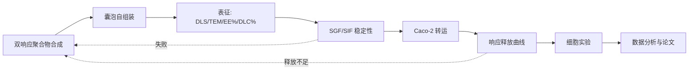

# 目标赛道申报书模板（草稿版）

> 项目：纳米材料生物制剂——肿瘤靶向治疗（囊泡包裹口服给药）
> 创建：2026-08-19 | 维护：Vesi
> 用途：目标赛道开始报名后，按此模板填写。`【】` 内为待填/待定项。
> 来源：grant-proposal-cn 技能 + 国家级立项实检索规律（grant-research-2026-08.md）

---

# 【项目名称：基于 pH/GSH 双响应聚合物囊泡口服递送【药物】的肿瘤靶向治疗研究】

> ⚠️ 命名公式：`[载体/响应机制] + [载荷] + [适应症] + 及机制研究`
> 备选标题：
> 1. 基于 pH/GSH 双响应聚合物囊泡口服递送化疗药的肿瘤靶向治疗研究
> 2. 【黏液穿透肽修饰】pH 敏感聚合物囊泡口服递送【药物】的构建与抗肿瘤研究
> 3. 【天然囊泡来源选项】口服递送【中药单体】的肿瘤靶向可行性研究

---

## 一、项目基本信息

| 项目 | 内容 |
|------|------|
| 项目名称 | 【待定】|
| 项目类型 | □ 创新训练 □ 创业训练 □ 创业实践 |
| 项目级别 | □ 国家级 □ 省级 □ 校级 |
| 项目负责人 | 【姓名/学号/专业】|
| 团队成员 | 【姓名/学号/分工】|
| 指导教师 | 【姓名/职称/研究方向】|
| 起止时间 | 【年-月至年-月】|
| 申请经费 | 【元】|

---

## 二、项目背景与研究意义

### 2.1 疾病负担

【事实数据】
- 中国癌症新发【XX】万例/年，死亡【XX】万例/年（来源：国家癌症中心/WHO）
- 化疗仍是主要治疗手段，但【副作用数据】

### 2.2 现有治疗痛点

- 注射给药：需住院/频繁就医，依从性差【引用依从性研究数据】
- 口服化疗药（如有）：生物利用度低、胃肠毒性

### 2.3 口服纳米制剂的价值

- 口服替代注射 → 依从性 ↑、医疗成本 ↓、慢病管理
- 纳米载体保护药物 + 靶向递送 → 增效减毒

### 2.4 本项目意义（一句话）

【本项目拟构建 XX，实现 XX，为 XX 提供新思路。】

---

## 三、国内外研究现状

### 3.1 口服递送四大屏障

- 胃肠道降解：胃 pH 1-3 + 酶【引用】
- 黏液屏障：200-700 μm【引用】
- 肠上皮吸收：跨/旁细胞【引用】
- 外排与首过：P-gp/CYP3A4【引用】
- → 详见知识库 [[胃肠道屏障]]

### 3.2 纳米载体研究现状

| 载体 | 优势 | 局限 | 口服适用性 |
|------|------|------|-----------|
| 脂质体 | 临床成熟 | 口服稳定性差 | 中 |
| 聚合物囊泡 | 膜坚韧可调 | 降解性需验证 | 高 |
| 外泌体 | 天然低免疫 | 量产难 | 中高 |
| → 详见知识库 [[载体选型对比]] |

### 3.3 微环境响应释放

- pH/GSH/ROS/酶 四类信号【各引 1 篇】
- 现有不足：单响应为主、口服路径信号干扰未充分验证
- → 详见知识库 [[响应释放]]

### 3.4 现有研究不足（Gap）

1. 【单响应 vs 双响应】
2. 【口服路径证据链缺失】
3. 【体内成立性未验证】

---

## 四、研究内容

### 4.1 模块一：双响应聚合物囊泡构建与表征

- 材料：【聚合物 A + 聚合物 B + 药物】
- 制备：【方法：薄膜水化/自组装/挤出】
- 表征：粒径/PDI/zeta（DLS）、形貌（TEM）、EE%/DLC%（HPLC/UV-vis）
- 预期：粒径 100-200 nm、PDI < 0.2、EE% > 【80%】

### 4.2 模块二：口服屏障模拟

- SGF/SIF 稳定性（粒径/释放变化）
- 黏液穿透实验（如有条件）
- Caco-2 单层转运（TEER、表观渗透系数 Papp）

### 4.3 模块三：响应释放评价

- pH 7.4 vs 5.0 释放曲线
- GSH 0 vs 10 mM 释放曲线
- 双响应组合（pH 5.0 + GSH 10 mM）

### 4.4 模块四：初步抗肿瘤评价（可选）

- 细胞摄取（荧光标记 + 共聚焦/流式）
- 细胞毒性（MTT/CCK-8）
- 斑马鱼（如有条件）

---

## 五、创新点（≤3 条）

### 创新点 1：pH/GSH 双响应聚合物囊泡

【别人做了单响应，我们双响应叠加 → 特异性更高；且 pH 敏感嵌段兼具胃部保护功能】

### 创新点 2：口服屏障完整体外证据链

【多数研究只做释放曲线；我们 SGF/SIF + Caco-2 双模型，直接回答"口服能不能行"】

### 创新点 3：【可选】

【如：天然来源/共递送/诊疗一体】

---

## 六、技术路线

---

## 七、可行性分析

### 7.1 实验条件

- 仪器：【学校平台 DLS/TEM 可预约；导师实验室 UV-vis/HPLC】
- 场地：【导师实验室】

### 7.2 前期基础

- 已完成【X】篇核心文献精读（知识库）
- 【如有预实验数据】

### 7.3 技术门槛

- 合成条件温和（本科可完成）
- 表征手段成熟（DLS/TEM/UV-vis 即可覆盖）

### 7.4 风险与对策

| 风险 | 对策 |
|------|------|
| 聚合物合成收率低 | 备选市售磷脂配方（路线 B）|
| 释放响应不理想 | 调整响应键比例/换响应键 |
| Caco-2 培养失败 | 换 MDCK 细胞/简化转运实验 |
| 时间不足 | 压缩表征范围、并行实验 |

---

## 八、进度安排

| 月份 | 任务 | 里程碑 |
|------|------|--------|
| 第 1-2 月 | 文献精读 + 方案定稿 + 材料采购 | 方案书定稿 |
| 第 3-5 月 | 载体构建与表征 | 完成 DLS/TEM/EE% |
| 第 6-8 月 | 稳定性 + Caco-2 + 释放 | 关键数据到手 |
| 第 9-10 月 | 细胞实验 + 数据分析 | 全部数据 |
| 第 11 月 | 论文写作 + 结题材料 | 初稿 |
| 第 12 月 | 结题答辩 | 结题 |

---

## 九、预期成果

- 论文 1 篇（目标期刊：【J Control Release / Int J Pharm 等】）
- 结题报告 1 份
- 答辩 PPT
- 【其他：专利/竞赛】

---

## 十、经费预算

| 项目 | 金额（元）| 说明 |
|------|----------|------|
| 材料费 | 【2000-4000】| 聚合物/磷脂/药物/试剂盒 |
| 测试费 | 【500-1500】| TEM/DLS 机时 |
| 耗材 | 【300-800】| 培养皿/枪头/离心管 |
| 其他 | 【200-500】| 打印/杂项 |
| **合计** | 【3000-6800】| 与目标赛道拨款匹配 |

---

## 十一、成员分工（如有多人）

| 成员 | 分工 |
|------|------|
| 【负责人】| 项目统筹、载体构建 |
| 【成员 2】| 表征与数据分析 |
| 【成员 3】| 细胞实验 |

---

## ✅ 提交前自查（审稿人模式）

- [ ] 创新点 ≤3 条且每条有实验支撑
- [ ] 技术路线图有闭环
- [ ] 经费预算合理
- [ ] 文献引用真实可查（PMID/DOI）
- [ ] 时间表与工作量匹配
- [ ] 社会意义有数据支撑
- [ ] 主动提及三大现实冷水并给对策
- [ ] 名称符合"载体+载荷+适应症"公式
